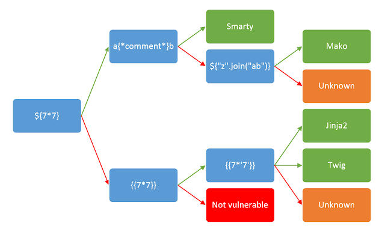

# recon
Recon
-----

### Set target variables

```text-plain
export URL="http://target:80"
```

```text-plain
export IP="10.10.0.1"
```

```text-plain
export SESSION="token"
```

### Nmap

```text-plain
nmap -p- -sC -sV $IP --open
```

### Fuzzing with Wfuzz

#### Directory discovery

```text-plain
wfuzz -c -z file,/usr/share/seclists/Discovery/Web-Content/raft-large-directories.txt --hc 404,301 "$URL/FUZZ/"
```

#### Authenticated directory discovery

```text-plain
wfuzz -c -z file,/usr/share/seclists/Discovery/Web-Content/raft-large-directories.txt --hc 404 -b "PARAM=value" "$URL/FUZZ/"
```

#### File discovery

```text-plain
wfuzz -c -z file,/usr/share/seclists/Discovery/Web-Content/raft-large-files.txt --hc 301,404 "$URL/FUZZ"
```

#### Authenticated file fuzzing

```text-plain
wfuzz -c -z file,/usr/share/seclists/Discovery/Web-Content/raft-large-files.txt --hc 301,404,403 -b "PARAM=value" "$URL/FUZZ"
```

#### Parameter discovery

```text-plain
wfuzz -c -z file,/usr/share/seclists/Discovery/Web-Content/burp-parameter-names.txt --hc 404,301 "$URL/FUZZ=data"
```

#### GET parameter values

```text-plain
wfuzz -c -z file,/usr/share/seclists/Usernames/cirt-default-usernames.txt --hc 404,301 "$URL/index.php?parameter=FUZZ"
```

#### html\_escape fuzzing

```text-plain
wfuzz -c -z file,/usr/share/wordlists/Fuzzing/yeah.txt "$URL/FUZZ"
```

### Gobuster

#### Endpoint discovery

```text-plain
gobuster dir -u $URL -w /usr/share/seclists/Discovery/Web-Content/raft-large-directories.txt
```

#### Subdomain discovery

```text-plain
gobuster dns -d $URL -w /usr/share/seclists/Discovery/DNS/subdomains-top1million-110000.txt
```

### CEWL

```message-http
# To spider a site and write all found words to a file
cewl -w wordlist.txt <url>
# To spider a site and follow links to other sites
cewl -o <url>
# To spider a site using a given user-agent 
cewl -u <user-agent> <url>
# To spider a site for a given depth and minimum word length
cewl -d <depth> -m <min word length> <url>
# To spider a site and include a count for each word
cewl -c <url>
# To spider a site inluding meta data and separate the meta_data words
cewl -a -meta_file <file> <url>
# To spider a site and store email adresses in a separate file
cewl -e -email_file <file> <url>
```

### FFUF

Sub domain discovery with Host headers

```text-plain
ffuf -w <Wordlist> -H "Host: FUZZ.acmeitsupport.thm" -u <IP>
```

### Feroxbuster

```text-plain
feroxbuster --url http://IP -d 2 -x php
```

### Templates



```text-plain
/usr/share/seclists/Fuzzing/template-engines-expressions.txt
```

### Hakrawler

```text-plain
echo "$URL" > urls.txt
cat urls.txt | hakrawler | sort | uniq -u
```

### Nikto

```text-plain
nikto --host $IP -ssl -evasion 1
```